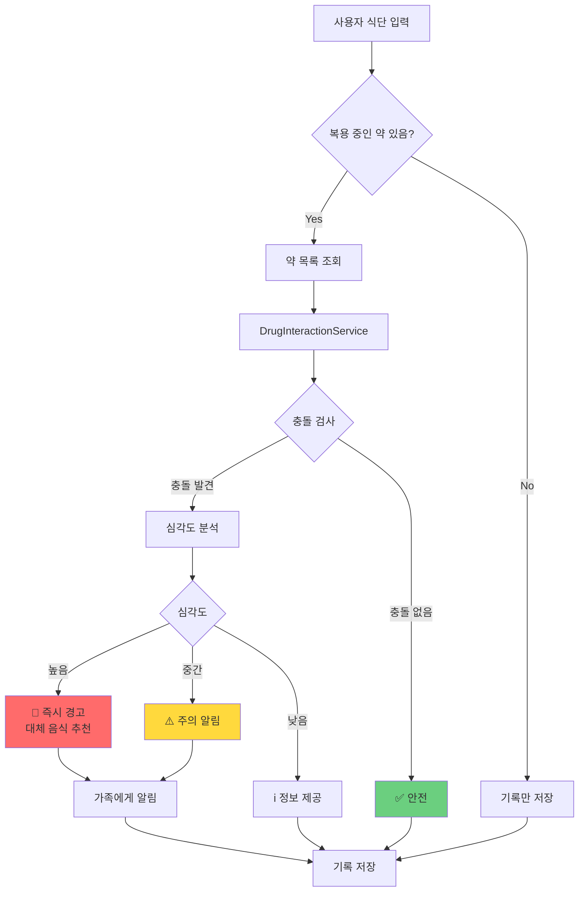
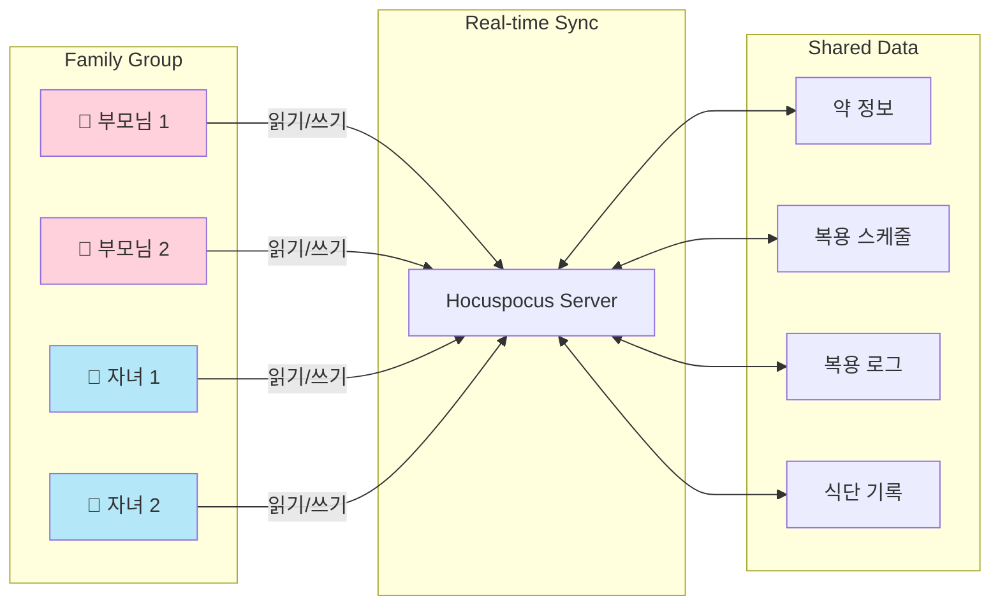
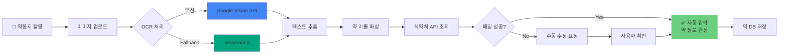
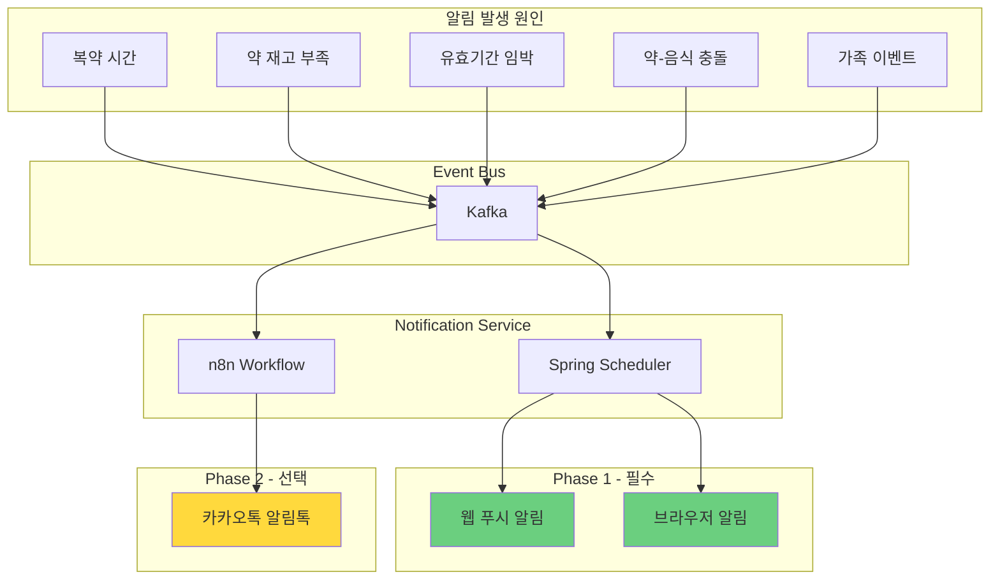
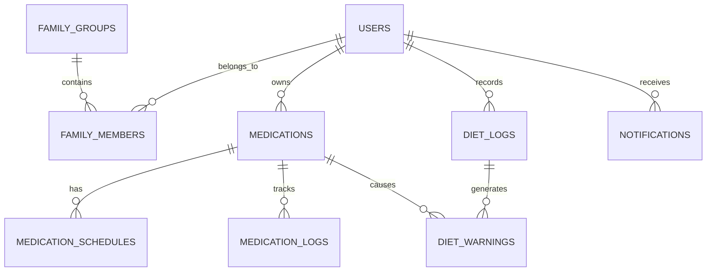
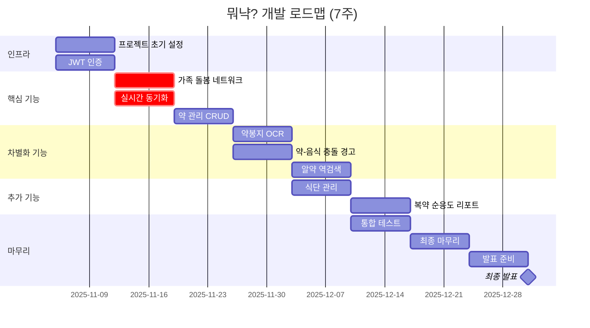
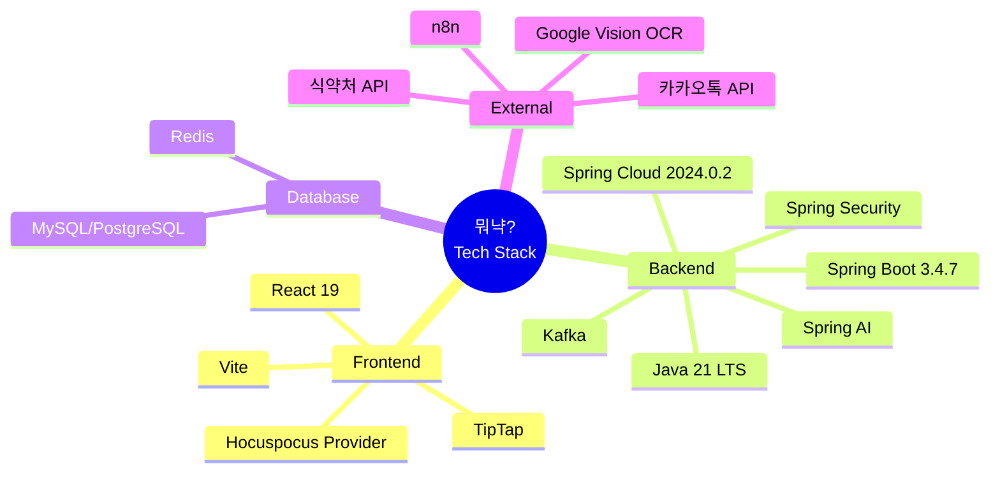

# 뭐냑? 시스템 아키텍처

> 가족 돌봄 네트워크 기반 약 관리 플랫폼

## 📁 다이어그램 파일 목록

모든 Mermaid 다이어그램은 `diagrams/` 폴더에 개별 파일로 저장되어 있습니다.

| 파일명 | 설명 | 용도 |
|--------|------|------|
| `01-system-architecture.mmd` | 전체 시스템 구조 | Frontend, Backend, Database, External Services |
| `02-data-flow.mmd` | 데이터 흐름도 | 시니어-자녀 간 실시간 동기화 시퀀스 |
| `03-drug-food-interaction.mmd` | 약-음식 충돌 감지 | 충돌 검사 및 경고 플로우차트 |
| `04-family-network.mmd` | 가족 돌봄 네트워크 | Spring WebSocket/STOMP 기반 실시간 공유 구조 |
| `05-ocr-pipeline.mmd` | OCR 처리 파이프라인 | 약봉지 인식 → 자동 등록 플로우 |
| `06-notification-system.mmd` | 알림 시스템 | Kafka 이벤트 기반 알림 아키텍처 |
| `07-database-erd-v6.2.mmd` | 데이터베이스 ERD | Mermaid 버전 (간략) |
| `08-development-timeline.mmd` | 7주 개발 타임라인 | Gantt 차트 |
| `09-tech-stack.mmd` | 기술 스택 | Mindmap 형식 |

---

## 🔐 MSA 인증 아키텍처 (Core Service)

### 인증 흐름

이 프로젝트는 **MSA(Microservice Architecture)** 구조의 **Core Service**입니다.

```
┌─────────────────┐     ┌─────────────────┐     ┌─────────────────┐
│   Client App    │────▶│  Nginx Gateway  │────▶│  Auth Service   │
└─────────────────┘     └────────┬────────┘     └─────────────────┘
                                 │ (JWT 검증 후)
                                 ▼
                        ┌─────────────────┐
                        │  Core Service   │ ← 이 프로젝트
                        │   (Port 8082)   │
                        └─────────────────┘
```

**MSA 인증 흐름**:
1. Client → Nginx Gateway: JWT 포함 요청
2. Nginx → Auth Service: `auth_request`로 JWT 검증
3. Auth Service → Nginx: 검증 결과 + 사용자 정보 헤더 설정
4. Nginx → Core Service: `X-User-*` 헤더로 사용자 정보 전달
5. Core Service: `SecurityUtil`로 헤더에서 사용자 정보 추출

**전달되는 헤더 (9개)**:
- `X-User-Id`: 사용자 PK
- `X-User-Email`: 이메일
- `X-User-Name`: 이름
- `X-User-Profile-Image`: 프로필 이미지 URL
- `X-User-Role`: 시스템 역할 (ROLE_USER, ROLE_ADMIN)
- `X-Customer-Role`: 고객 역할 (SENIOR, CAREGIVER)
- `X-Token-Subject`: 토큰 subject
- `X-Token-Type`: 토큰 타입 (ACCESS)
- `X-Request-Id`: 요청 추적 ID

### SecurityUtil 사용법

```java
// Controller에서 사용자 정보 추출
@RestController
@RequiredArgsConstructor
public class MedicationController {
    private final HttpServletRequest request;

    @GetMapping("/medications")
    public ResponseEntity<List<MedicationResponse>> getMyMedications() {
        Long userId = SecurityUtil.getCurrentUserId(request);
        return ResponseEntity.ok(medicationService.getMyMedications(userId));
    }
}
```

---

## 1️⃣ 전체 시스템 구조 (마이크로서비스 아키텍처)

**파일**: `diagrams/01-system-architecture.mmd`

### 아키텍처 다이어그램

```
┌─────────────────────────────────────────────────────────────┐
│                    Frontend (React 19 + Vite)               │
│                    + Hocuspocus Client (공동편집용)          │
└──────────────┬──────────────────────────────┬───────────────┘
               │ HTTPS                        │ WebSocket
               ▼                              ▼
┌──────────────────────────┐      ┌──────────────────────────┐
│         Nginx            │      │   Hocuspocus Server      │
│    (Reverse Proxy)       │      │   (공동편집 - 게시글)     │
└──────────────┬───────────┘      │   + Y.js CRDT            │
               │                  └──────────────────────────┘
               ▼
┌─────────────────────────────────────────────────────────────┐
│              Spring Cloud Gateway (Port 8080)               │
│  • JWT 검증, X-User-* 헤더 주입                             │
│  • Circuit Breaker, Redis 캐싱, Kafka 로깅                  │
└──────────────┬────────────────────────────┬─────────────────┘
               │                            │
               ▼                            ▼
┌──────────────────────────┐  ┌──────────────────────────────┐
│   Auth Service (8081)    │  │    Core Service (8082)       │
│  • 로그인/회원가입        │  │  • /api/family/**            │
│  • JWT 발급              │  │  • /api/medications/**       │
│  • 카카오 OAuth          │  │  • /api/diet/**              │
└──────────────────────────┘  │  • /api/ocr/**               │
                              │  • /api/chat/**              │
                              │  • /api/search/**            │
                              │  • /api/disease/**           │
                              │  • /api/counsel/**           │
                              │  • /api/notifications/**     │
                              │  • /api/reports/**           │
                              │  • /ws/** (Spring WebSocket) │
                              └──────────────────────────────┘
                                           │
                              ┌────────────┴────────────┐
                              ▼                         ▼
                     ┌──────────────┐          ┌──────────────┐
                     │    Kafka     │          │    Redis     │
                     │ (이벤트 버스) │          │   (캐시)     │
                     └──────────────┘          └──────────────┘
```

### 계층 구성

- **마이크로서비스**: 2개 서비스
  - **Auth Service (8081)**: 인증/인가
  - **Core Service (8082)**: 통합 비즈니스 로직 (가족, 약물, 식단, OCR, 채팅, 검색, 질병, 상담, 알림, 리포트)
- **실시간 동기화**:
  - **일반 실시간 통신 (알림, 상태 동기화)**: Spring WebSocket/STOMP + Kafka
  - **공동편집 (게시글 편집)**: Hocuspocus + Y.js CRDT

### 주요 구성 요소

#### Frontend Layer
- **React 19 + Vite**: JSX only (React Native 사용 금지)
- **STOMP WebSocket Client**: 실시간 양방향 통신 (알림, 상태 동기화)
- **Hocuspocus Client**: 공동편집 게시글용 (Y.js CRDT)
- **TipTap Editor**: 리치 텍스트 편집기

#### Spring Cloud Infrastructure
- **API Gateway (Spring Cloud Gateway)**: 단일 진입점, JWT 검증, 라우팅, Circuit Breaker
- **Eureka Server / Config Server**: 미사용

#### Microservices (2개 서비스)
- **Auth Service (8081)**: 인증/인가, JWT 토큰 관리
- **Core Service (8082)**: 통합 비즈니스 로직

**상세 내용**: [MICROSERVICES_SETUP.md](./MICROSERVICES_SETUP.md#-9-stack-구성) 참조

#### Real-time Sync Layer (🔥 핵심 차별점)

**일반 실시간 통신 (알림, 복약 상태 등)**:
- **Spring WebSocket/STOMP**: WebSocket 기반 실시간 양방향 통신
- **Message Broker**: In-Memory SimpleBroker 사용
- **Kafka 연동**: 백엔드 이벤트 → Kafka → Spring WebSocket → Frontend Push
- **Session Management**: Redis 기반 WebSocket 세션 관리

**공동편집 (게시글 편집)**:
- **Hocuspocus Server**: 실시간 문서 동기화
- **Y.js CRDT**: 충돌 자동 해결

#### Event Processing
- **Apache Kafka**: 이벤트 기반 비동기 처리
- **토픽 분리**: Medication Events, Notification Events, Family Events, Sync Events

#### Database Layer
- **MySQL 8.0**: 메인 데이터베이스 (트랜잭션 데이터)
- **PostgreSQL 16**: 실시간 동기화 (Hocuspocus Y.js CRDT - 선택)
- **Redis 7+**: 세션, 캐시, WebSocket 세션 관리, **Refresh Token 저장**

**데이터베이스 분리 전략**: [MICROSERVICES_SETUP.md](./MICROSERVICES_SETUP.md#-데이터베이스-분리-전략) 참조

#### External Services
- **식약처 API**: 의약품안전나라 공공 API
- **Google Vision OCR**: 약봉지 자동 인식
- **카카오톡 API**: 알림톡 (Phase 2)
- **n8n**: 워크플로우 자동화

---

## 2️⃣ 데이터 흐름도 (마이크로서비스 + 실시간 동기화)

**파일**: `diagrams/02-data-flow.mmd`

### 핵심 시나리오

#### 시나리오 1: 시니어가 약 복용을 체크하면 자녀에게 실시간 알림
- **흐름**: 웹 → Nginx → Gateway → Core Service → Kafka → Spring WebSocket → 자녀 앱

```
시니어 웹 ─→ Nginx ─→ API Gateway ─→ Core Service ─→ DB 저장
                                          │
                                          ▼
                                       Kafka
                                          │
                                          ▼
                                Spring WebSocket ─→ 자녀 웹 (🔔 알림)
```

#### 시나리오 2: 자녀가 원격으로 약 등록 (시니어에게 실시간 알림)
- **흐름**: 웹 → Nginx → Gateway → Core Service (권한 확인) → Kafka → Spring WebSocket → 시니어 앱

#### 시나리오 3: 약-음식 충돌 경고 (실시간 경고)
- **Rule Engine**: 복용 중인 약과 식단 자동 비교
- **심각도 분석**: 높음/중간/낮음 등급 분류
- **가족 알림**: 충돌 발견 시 Spring WebSocket으로 자녀에게도 즉시 알림

#### 시나리오 (공동편집): 가족이 함께 게시글 편집
- **흐름**: 웹 → Hocuspocus Server → Y.js CRDT 동기화 → 실시간 공동편집

```
사용자 A (편집) ─┐
                 │─→ Hocuspocus Server ─→ Y.js CRDT 동기화 ─→ 모든 참여자에게 실시간 반영
사용자 B (편집) ─┘
```

---

## 3️⃣ 약-음식 충돌 감지 플로우

**파일**: `diagrams/03-drug-food-interaction.mmd`



### 차별화 기능

- 룰 베이스 시스템 (AI 불필요)
- 심각도별 차등 대응 (높음/중간/낮음)
- 가족에게 즉시 알림 (높음/중간 등급)

---

## 4️⃣ 가족 돌봄 네트워크 구조

**파일**: `diagrams/04-family-network.mmd`



### 핵심 가치

- 떨어져 있어도 부모님 건강 관리 가능
- 권한 관리 (읽기/쓰기 분리 가능)

**기술**:
- **실시간 알림/상태 동기화**: Spring WebSocket/STOMP + Kafka
- **공동편집 (게시글 편집)**: Hocuspocus + Y.js CRDT

---

## 5️⃣ OCR 처리 파이프라인

**파일**: `diagrams/05-ocr-pipeline.mmd`



### OCR 전략

- **우선순위 1**: Google Vision API (무료 1,000건/월, 인식률 95%+)
- **Fallback**: Tesseract.js (완전 무료, 인식률 80%)
- Naver Clova OCR 제외 (유료)

---

## 6️⃣ 알림 시스템 아키텍처

**파일**: `diagrams/06-notification-system.mmd`



### 알림 전략

- **Phase 1 (필수)**: 웹 푸시 알림, 브라우저 알림
- **Phase 2 (선택)**: 카카오톡 알림톡 (시간 있으면)
- React Native 사용 금지 → 모바일 네이티브 알림 불가

---

## 7️⃣ 데이터베이스 ERD

**파일**: `07-database-erd-v6.2.mmd`

상세한 ERD는 `07-database-erd-v6.2.mmd` 파일 참조 (dbdiagram.io 형식)



### 주요 테이블 (22개)

#### 핵심 테이블 (기존)
1. `users` - 사용자 정보
2. `family_groups` - 가족 그룹
3. `family_members` - 가족 구성원 매핑
4. `medications` - 약 정보
5. `medication_schedules` - 복용 일정
6. `medication_logs` - 복용 기록
7. `drug_food_interactions` - 약-음식 충돌 정보
8. `diet_logs` - 식단 기록
9. `diet_warnings` - 식단-약 충돌 경고
10. `notifications` - 알림

#### 신규 테이블 (확장 기능)
11. `medication_reviews` - 약/성분 리뷰 및 후기
12. `symptom_searches` - 증상 검색 이력
13. `suspected_diseases` - 의심 질환 및 약국 상담 추천
14. `disease_info` - 질병 정보 마스터 데이터
15. `user_diseases` - 사용자 질병 관리
16. `disease_restricted_foods` - 질병별 기피 음식
17. `disease_restricted_ingredients` - 질병별 기피 성분
18. `disease_restricted_medications` - 질병별 기피 약
19. `hospital_diet_resources` - 병원 공식 식단 자료
20. `hospital_diet_items` - 병원 식단 상세 항목

---

## 8️⃣ 7주 개발 타임라인

**파일**: `diagrams/08-development-timeline.mmd`



### 주요 마일스톤

- **Week 1-2**: 인프라 + 가족 돌봄 네트워크 (핵심!)
- **Week 3-4**: 약 관리 + 차별화 기능 (OCR, 약-음식 충돌)
- **Week 5-6**: 추가 기능 + 통합 테스트
- **Week 7-8**: 마무리 + 발표 준비
- **12/31**: 최종 발표일 🎉

---

## 9️⃣ 기술 스택

**파일**: `diagrams/09-tech-stack.mmd`



### 백엔드 기술 스택 선정 이유

#### Java 21 LTS
- **장기 지원**: 2029년까지 지원 보장
- **Virtual Threads**: 고성능 동시성 처리
- **ZGC**: 저지연 가비지 컬렉션
- **프로덕션 검증**: 충분히 안정화된 LTS 버전

#### Spring Boot 3.4.7 (2025년 6월)
- **안정성**: 6개월 이상 검증된 안정 버전
- **버그 수정**: 49개 버그 수정 및 의존성 업그레이드
- **프로덕션 준비**: 실무 환경에서 충분히 검증됨
- **3.5.0 제외 이유**: 너무 최신 (2025년 5월 출시, 검증 부족)

#### Spring Cloud 2024.0.2 (Moorgate)
- **Spring Boot 3.4.x 완벽 호환**
- **Spring Framework 6.2.0 통합**
- **Eureka Server 최신 기능 지원**
- **마이크로서비스 아키텍처 대비**

---

## 🏗️ Spring Cloud 컴포넌트 상세 설명

### 1. API Gateway (Spring Cloud Gateway) - 구현 완료

#### 역할
- **단일 진입점**: 모든 클라이언트 요청의 단일 엔드포인트
- **JWT 인증**: Gateway에서 직접 HS512 알고리즘 기반 Access 토큰 검증
- **마이크로서비스 라우팅**: 11개 백엔드 서비스로의 동적 라우팅
- **Circuit Breaker**: Resilience4j 기반 서비스별 장애 격리
- **응답 캐싱**: Redis 기반 GET 요청 응답 캐싱
- **이벤트 로깅**: Kafka를 통한 요청/응답/에러 이벤트 발행
- **CORS 지원**
- **모니터링**: Actuator 및 Prometheus 메트릭

#### 기술 스택
- Spring Cloud Gateway (WebFlux 기반)
- Redis 7 (Reactive 캐싱)
- Kafka (이벤트 발행)
- Resilience4j 2.1.0 (Circuit Breaker)
- JJWT 0.12.6 (JWT 검증)

#### 마이크로서비스 라우팅 (11개)
| 경로 | 대상 서비스 | 포트 |
|------|-------------|------|
| `/api/auth/**` | Auth Service | 8081 |
| `/api/family/**` | Family Service (Core) | 8082 |
| `/ws/**` | Family Service (WebSocket) | 8082 |
| `/api/medications/**` | Medication Service (Core) | 8082 |
| `/api/diet/**` | Diet Service (Core) | 8082 |
| `/api/ocr/**` | OCR Service (Core) | 8082 |
| `/api/chat/**` | Chat Service (Core) | 8082 |
| `/api/search/**` | Search Service (Core) | 8082 |
| `/api/disease/**` | Disease Service (Core) | 8082 |
| `/api/counsel/**` | Counsel Service (Core) | 8082 |
| `/api/notifications/**` | Notification Service (Core) | 8082 |
| `/api/reports/**` | Report Service (Core) | 8082 |

#### X-User-* 헤더 주입 (9개)
Gateway에서 JWT 검증 후 백엔드 서비스로 전달하는 헤더:
- `X-User-Id`: 사용자 PK
- `X-User-Email`: 이메일
- `X-User-Name`: 이름
- `X-User-Profile-Image`: 프로필 이미지 URL
- `X-User-Role`: 시스템 역할 (ROLE_USER, ROLE_ADMIN)
- `X-Customer-Role`: 고객 역할 (SENIOR, CAREGIVER)
- `X-Token-Subject`: 토큰 subject
- `X-Token-Type`: 토큰 타입 (ACCESS)
- `X-Request-Id`: 요청 추적 ID

#### 인증 제외 경로
- `/api/auth/login`, `/api/auth/signup`, `/api/auth/kakao-login`, `/api/auth/refresh`
- `/actuator/health`, `/health`

#### 포트 구성
**전체 포트 목록**: [MICROSERVICES_SETUP.md](./MICROSERVICES_SETUP.md#-9-stack-구성) 참조

---

### 2. Eureka Server / Config Server

> **미사용**: 현재 아키텍처에서는 Eureka Server와 Config Server를 사용하지 않습니다.
> Auth Service (8081)와 Core Service (8082)로 통합된 2개 서비스 구조로 운영됩니다.

---

### 3. 서비스 간 통신 (OpenFeign)

#### Feign Client 예시
Medication Service에서 Family Service 호출:

```java
@FeignClient(name = "family-service")
public interface FamilyServiceClient {

    @GetMapping("/api/families/verify")
    FamilyPermissionResponse verifyPermission(
        @RequestParam Long userId,
        @RequestParam Long familyId
    );
}
```

#### 사용 예시
```java
@Service
public class MedicationService {

    @Autowired
    private FamilyServiceClient familyServiceClient;

    public void createMedication(MedicationRequest request) {
        // 가족 권한 확인
        FamilyPermissionResponse permission = familyServiceClient
            .verifyPermission(request.getUserId(), request.getFamilyId());

        if (!permission.isAuthorized()) {
            throw new UnauthorizedException("권한이 없습니다.");
        }

        // 약 등록 로직
        // ...
    }
}
```

---

### 4. 실시간 동기화 아키텍처

#### 일반 실시간 통신 (알림, 복약 상태 등)

```
Backend Services → Kafka Topic → Spring WebSocket/STOMP → 클라이언트
```

- **Kafka 토픽**: gateway-events, medication-events, family-events, notification-events
- **Spring WebSocket/STOMP**: Core Service 내 `/ws/**` 엔드포인트로 실시간 푸시
- **용도**: 복약 알림, 가족 이벤트 알림, 상태 동기화

#### 공동편집 (게시글 편집)

```
Frontend (TipTap Editor) ←→ Hocuspocus Server ←→ Y.js CRDT ←→ PostgreSQL
```

- **Hocuspocus Server**: 실시간 문서 동기화 서버
- **Y.js CRDT**: 충돌 자동 해결 (Conflict-free Replicated Data Type)
- **용도**: 게시글 공동편집 기능

#### Kafka Topics
- `gateway-events`: API Gateway 요청/응답 이벤트
- `medication-events`: 약 관련 이벤트
- `family-events`: 가족 네트워크 이벤트
- `notification-events`: 알림 이벤트

---

### 5. 마이크로서비스 배포 구조

#### Docker Compose 예시
```yaml
version: '3.8'

services:
  api-gateway:
    image: amapill/api-gateway:latest
    ports:
      - "8080:8080"
    depends_on:
      - auth-service
      - core-service
      - redis
      - kafka

  auth-service:
    image: amapill/auth-service:latest
    ports:
      - "8081:8081"
    depends_on:
      - mysql
      - redis

  core-service:
    image: amapill/core-service:latest
    ports:
      - "8082:8082"
    depends_on:
      - mysql
      - redis
      - kafka

  hocuspocus-server:
    image: amapill/hocuspocus-server:latest
    ports:
      - "1234:1234"
    depends_on:
      - postgresql

  mysql:
    image: mysql:8.0
    ports:
      - "3306:3306"
    environment:
      MYSQL_ROOT_PASSWORD: root
      MYSQL_DATABASE: amapill

  postgresql:
    image: postgres:16
    ports:
      - "5432:5432"
    environment:
      POSTGRES_DB: amapill_sync
      POSTGRES_PASSWORD: postgres

  redis:
    image: redis:7
    ports:
      - "6379:6379"

  kafka:
    image: confluentinc/cp-kafka:7.5.0
    ports:
      - "9092:9092"
    environment:
      KAFKA_ADVERTISED_LISTENERS: PLAINTEXT://localhost:9092
```

---

## 📖 사용 방법

### GitHub에서 보기
GitHub는 `.md` 파일 내의 Mermaid 코드 블록을 자동 렌더링합니다.

### VS Code에서 보기
1. Mermaid 플러그인 설치
2. `.mmd` 파일 또는 `.md` 파일 열기
3. 미리보기 패널에서 확인

### Mermaid Live Editor
1. https://mermaid.live 접속
2. `diagrams/*.mmd` 파일 내용 복사
3. 실시간 편집 및 내보내기 (PNG, SVG)

### Notion/Obsidian
Mermaid 코드 블록을 복사해서 붙여넣기

---

## 📝 참고 사항

### 서비스 구조
- **마이크로서비스**: 2개 서비스 (Auth Service 8081 + Core Service 8082)
- **Eureka Server / Config Server**: 미사용

### 실시간 통신 정리

| 용도 | 기술 | 설명 |
|------|------|------|
| 알림 (복약, 가족 이벤트) | Spring WebSocket/STOMP + Kafka | 서버 → 클라이언트 푸시 |
| 상태 동기화 (복약 체크 등) | Spring WebSocket/STOMP + Kafka | 실시간 상태 브로드캐스트 |
| 공동편집 (게시글 편집) | Hocuspocus + Y.js CRDT | 실시간 문서 동기화, 충돌 자동 해결 |

### 기술 스택
- **메시지 브로커**: In-Memory SimpleBroker (RabbitMQ 사용 안 함)
- **OCR**: Google Vision → Tesseract Fallback
- **약-음식 충돌**: 룰 베이스 시스템
- **알림**: Phase 1 필수, Phase 2 선택
- **React Native 금지**: 웹 앱만 사용
- **ORM**: MyBatis 3.0.3 (JPA 대신 사용, 동적 SQL 지원)
- **AI/Vector**: Spring AI 1.0.3 (Redis Vector Store)
- **인프라**: Spring Cloud Gateway + Docker Compose
- **MSA 인증**: Gateway JWT 검증 → X-User-* 헤더 주입 (9개) → SecurityUtil 추출
- **API Gateway**: 구현 완료 (11개 라우팅, Circuit Breaker, Redis 캐싱, Kafka 이벤트)
- **Auth Service 빌드**: Gradle 8.x (Maven에서 변경)
- **Refresh Token**: Redis에 저장 (MySQL refresh_tokens 테이블 제거)

---

**문서 버전**: 2.0 (개별 파일 분리)
**생성일**: 2025-11-05
**상태**: Mermaid 다이어그램 완성 (9개 파일)
