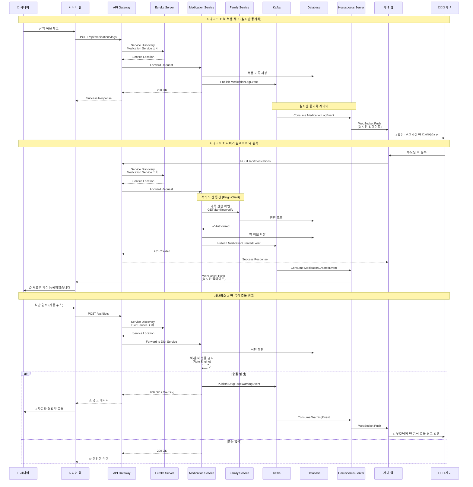
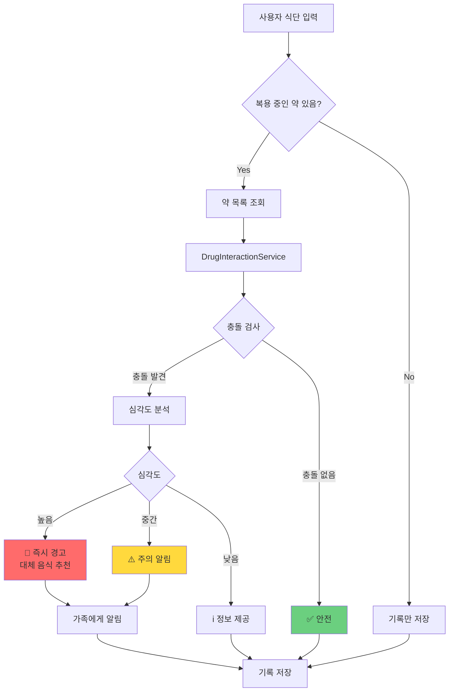
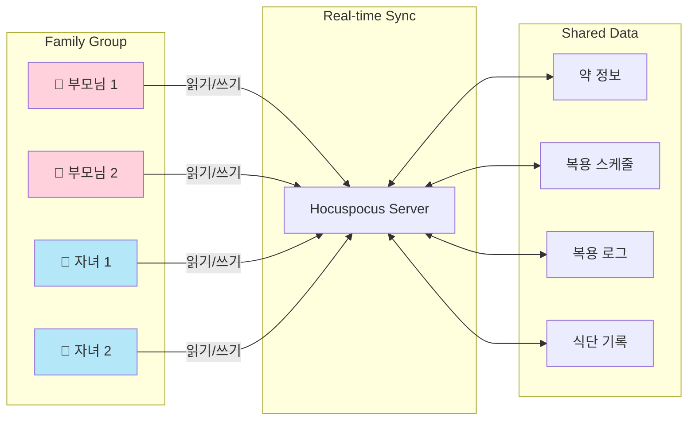
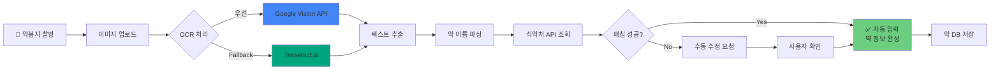
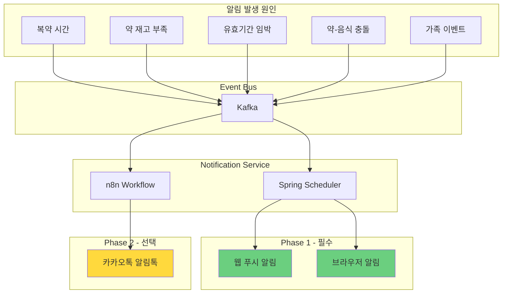
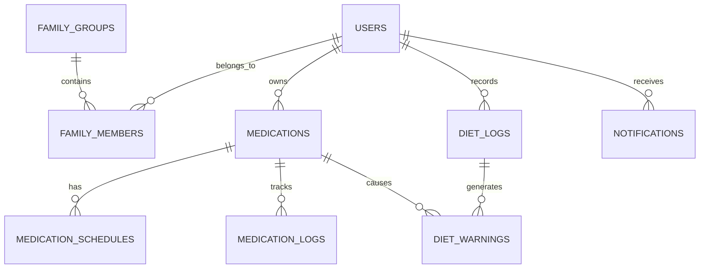
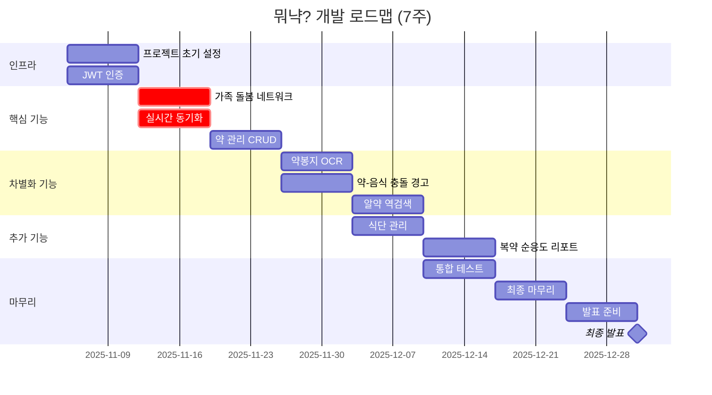
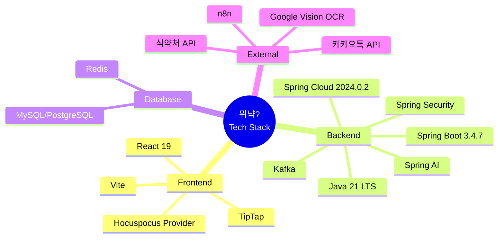

# 뭐냑? 시스템 아키텍처

> 가족 돌봄 네트워크 기반 약 관리 플랫폼

## 📁 다이어그램 파일 목록

모든 Mermaid 다이어그램은 `diagrams/` 폴더에 개별 파일로 저장되어 있습니다.

| 파일명 | 설명 | 용도 |
|--------|------|------|
| `01-system-architecture.mmd` | 전체 시스템 구조 | Frontend, Backend, Database, External Services |
| `02-data-flow.mmd` | 데이터 흐름도 | 시니어-자녀 간 실시간 동기화 시퀀스 |
| `03-drug-food-interaction.mmd` | 약-음식 충돌 감지 | 충돌 검사 및 경고 플로우차트 |
| `04-family-network.mmd` | 가족 돌봄 네트워크 | Spring WebSocket/STOMP 기반 실시간 공유 구조 |
| `05-ocr-pipeline.mmd` | OCR 처리 파이프라인 | 약봉지 인식 → 자동 등록 플로우 |
| `06-notification-system.mmd` | 알림 시스템 | Kafka 이벤트 기반 알림 아키텍처 |
| `07-database-erd-v6.2.mmd` | 데이터베이스 ERD | Mermaid 버전 (간략) |
| `08-development-timeline.mmd` | 7주 개발 타임라인 | Gantt 차트 |
| `09-tech-stack.mmd` | 기술 스택 | Mindmap 형식 |

---

## 🔐 MSA 인증 아키텍처 (Core Service)

### 인증 흐름

이 프로젝트는 **MSA(Microservice Architecture)** 구조의 **Core Service**입니다.

```
┌─────────────────┐     ┌─────────────────┐     ┌─────────────────┐
│   Client App    │────▶│  Nginx Gateway  │────▶│  Auth Service   │
└─────────────────┘     └────────┬────────┘     └─────────────────┘
                                 │ (JWT 검증 후)
                                 ▼
                        ┌─────────────────┐
                        │  Core Service   │ ← 이 프로젝트
                        │   (Port 8082)   │
                        └─────────────────┘
```

**MSA 인증 흐름**:
1. Client → Nginx Gateway: JWT 포함 요청
2. Nginx → Auth Service: `auth_request`로 JWT 검증
3. Auth Service → Nginx: 검증 결과 + 사용자 정보 헤더 설정
4. Nginx → Core Service: `X-User-*` 헤더로 사용자 정보 전달
5. Core Service: `SecurityUtil`로 헤더에서 사용자 정보 추출

**전달되는 헤더 (9개)**:
- `X-User-Id`: 사용자 PK
- `X-User-Email`: 이메일
- `X-User-Name`: 이름
- `X-User-Profile-Image`: 프로필 이미지 URL
- `X-User-Role`: 시스템 역할 (ROLE_USER, ROLE_ADMIN)
- `X-Customer-Role`: 고객 역할 (SENIOR, CAREGIVER)
- `X-Token-Subject`: 토큰 subject
- `X-Token-Type`: 토큰 타입 (ACCESS)
- `X-Request-Id`: 요청 추적 ID

### SecurityUtil 사용법

```java
// Controller에서 사용자 정보 추출
@RestController
@RequiredArgsConstructor
public class MedicationController {
    private final HttpServletRequest request;

    @GetMapping("/medications")
    public ResponseEntity<List<MedicationResponse>> getMyMedications() {
        Long userId = SecurityUtil.getCurrentUserId(request);
        return ResponseEntity.ok(medicationService.getMyMedications(userId));
    }
}
```

---

## 1️⃣ 전체 시스템 구조 (마이크로서비스 아키텍처)

**파일**: `diagrams/01-system-architecture.mmd`

```mermaid
graph TB
    subgraph "Frontend Layer"
        A[React Web App]
        A1[Auth Components]
        A2[Family Components]
        A3[Medication Components]
        A4[Diet Components]
        A5[Dashboard]

        A --> A1
        A --> A2
        A --> A3
        A --> A4
        A --> A5
    end

    subgraph "Spring Cloud Infrastructure"
        GW[API Gateway<br/>Spring Cloud Gateway]
        EUR[Eureka Server<br/>Service Discovery]
        CFG[Config Server<br/>중앙 설정 관리]
    end

    subgraph "Microservices"
        AUTH[Auth Service<br/>인증/인가/JWT]
        MED[Medication Service<br/>약 관리]
        FAM[Family Service<br/>가족 네트워크]
        DIET[Diet Service<br/>식단 관리]
        NOTI[Notification Service<br/>알림]
        OCR[OCR Service<br/>약봉지 인식]
    end

    subgraph "Real-time Sync Layer"
        WS[Spring WebSocket/STOMP<br/>실시간 채팅]
        H[Hocuspocus Server (선택)<br/>공동편집 에디터]
        H1[Y.js CRDT<br/>Conflict Resolution]
        H --> H1
    end

    subgraph "Event Processing"
        K[Apache Kafka]
        K1[Medication Events]
        K2[Notification Events]
        K3[Family Events]
        K4[Sync Events]

        K --> K1
        K --> K2
        K --> K3
        K --> K4
    end

    subgraph "Database Layer"
        DB[(MySQL 8.0<br/>Main DB)]
        R[(Redis<br/>Cache/Session)]
        SYNC[(Hocuspocus DB<br/>Sync Storage)]
    end

    subgraph "External Services"
        E1[식약처 API<br/>의약품안전나라]
        E2[Google Vision OCR<br/>약봉지 인식]
        E3[카카오톡 API<br/>알림톡]
        E4[n8n Workflow<br/>자동화]
    end

    %% Frontend connections
    A -->|HTTP/REST| GW
    A -->|WebSocket (채팅)| WS
    A -->|WebSocket (편집)| H

    %% API Gateway connections
    GW --> EUR
    GW --> AUTH
    GW --> MED
    GW --> FAM
    GW --> DIET
    GW --> NOTI
    GW --> OCR

    %% Service Discovery
    EUR -.->|Register| AUTH
    EUR -.->|Register| MED
    EUR -.->|Register| FAM
    EUR -.->|Register| DIET
    EUR -.->|Register| NOTI
    EUR -.->|Register| OCR

    %% Config Server
    CFG -.->|Config| AUTH
    CFG -.->|Config| MED
    CFG -.->|Config| FAM
    CFG -.->|Config| DIET
    CFG -.->|Config| NOTI
    CFG -.->|Config| OCR

    %% Microservices to Database
    AUTH --> DB
    AUTH --> R
    MED --> DB
    MED --> R
    FAM --> DB
    FAM --> R
    DIET --> DB
    NOTI --> DB
    OCR --> DB

    %% Microservices to Kafka
    MED -->|Publish| K1
    FAM -->|Publish| K3
    DIET -->|Publish| K1
    NOTI -->|Consume| K2

    %% Kafka to Hocuspocus (Real-time Sync)
    K1 -->|Sync Events| H
    K3 -->|Family Events| H
    K4 -->|State Changes| H

    %% Hocuspocus connections
    H <-->|Persist| SYNC
    H -->|Read/Write| DB

    %% External API connections
    MED --> E1
    OCR --> E2
    NOTI --> E3
    K --> E4

    %% Service-to-Service communication
    MED -.->|Feign Client| FAM
    DIET -.->|Feign Client| MED
    NOTI -.->|Feign Client| FAM

    %% Styling
    style A fill:#61dafb,stroke:#333,stroke-width:2px
    style GW fill:#68bc00,stroke:#333,stroke-width:3px
    style EUR fill:#68bc00,stroke:#333,stroke-width:2px
    style CFG fill:#68bc00,stroke:#333,stroke-width:2px

    style AUTH fill:#6db33f,stroke:#333,stroke-width:2px
    style MED fill:#6db33f,stroke:#333,stroke-width:2px
    style FAM fill:#6db33f,stroke:#333,stroke-width:2px
    style DIET fill:#6db33f,stroke:#333,stroke-width:2px
    style NOTI fill:#6db33f,stroke:#333,stroke-width:2px
    style OCR fill:#6db33f,stroke:#333,stroke-width:2px

    style H fill:#ff6b35,stroke:#333,stroke-width:3px
    style H1 fill:#ff6b35,stroke:#333,stroke-width:2px

    style K fill:#231f20,color:#fff,stroke:#fff,stroke-width:2px
    style DB fill:#4479a1,stroke:#333,stroke-width:2px
    style R fill:#dc382d,stroke:#333,stroke-width:2px
    style SYNC fill:#ff9500,stroke:#333,stroke-width:2px
```

### 주요 구성 요소

#### Frontend Layer
- **React 19 + Vite**: JSX only (React Native 사용 금지)
- **STOMP WebSocket Client**: 실시간 양방향 통신
- **TipTap Editor**: 리치 텍스트 편집기

#### Spring Cloud Infrastructure (🆕 추가)
- **API Gateway (Spring Cloud Gateway)**: 단일 진입점, 라우팅, 인증/인가
- **Eureka Server**: 서비스 디스커버리, 동적 서비스 등록/조회
- **Config Server**: 중앙 설정 관리, Git 기반 외부 설정

#### Microservices (도메인별 분리)
6개의 독립적인 마이크로서비스로 구성됩니다.

**상세 내용**: [MICROSERVICES_SETUP.md](./MICROSERVICES_SETUP.md#-9-stack-구성) 참조

#### Real-time Sync Layer (🔥 핵심 차별점)
- **Spring WebSocket/STOMP**: WebSocket 기반 실시간 양방향 통신 (실시간 채팅용)
- **Message Broker**: In-Memory SimpleBroker 사용
- **Kafka 연동**: 백엔드 이벤트 → Kafka → WebSocket → Frontend Push
- **Session Management**: Redis 기반 WebSocket 세션 관리
- **Hocuspocus (선택)**: 공동편집 게시글 에디터 전용 (Y.js CRDT 지원)

#### Event Processing
- **Apache Kafka**: 이벤트 기반 비동기 처리
- **토픽 분리**: Medication Events, Notification Events, Family Events, Sync Events

#### Database Layer
- **MySQL 8.0**: 메인 데이터베이스 (트랜잭션 데이터)
- **PostgreSQL 16**: 실시간 동기화 (Hocuspocus Y.js CRDT - 선택)
- **Redis 7+**: 세션, 캐시, WebSocket 세션 관리, **Refresh Token 저장**

**데이터베이스 분리 전략**: [MICROSERVICES_SETUP.md](./MICROSERVICES_SETUP.md#-데이터베이스-분리-전략) 참조

#### External Services
- **식약처 API**: 의약품안전나라 공공 API
- **Google Vision OCR**: 약봉지 자동 인식
- **카카오톡 API**: 알림톡 (Phase 2)
- **n8n**: 워크플로우 자동화

---

## 2️⃣ 데이터 흐름도 (마이크로서비스 + 실시간 동기화)

**파일**: `diagrams/02-data-flow.mmd`



### 핵심 시나리오

#### 1. 약 복용 체크 (시니어 → 자녀)
- **흐름**: 시니어 웹 → API Gateway → Eureka Discovery → Medication Service → Kafka → Hocuspocus → 자녀 웹
- **핵심 기술**: Service Discovery, 이벤트 기반 아키텍처, WebSocket Push
- **실시간성**: Kafka Consumer가 즉시 Hocuspocus로 이벤트 전달

#### 2. 원격 약 등록 (자녀 → 시니어)
- **서비스 간 통신**: Medication Service ↔ Family Service (Feign Client)
- **권한 확인**: 자녀가 부모님 데이터를 수정할 권한이 있는지 검증
- **양방향 동기화**: Kafka → Hocuspocus → 시니어 웹 (즉시 반영)

#### 3. 약-음식 충돌 경고 (실시간 경고)
- **Rule Engine**: 복용 중인 약과 식단 자동 비교
- **심각도 분석**: 높음/중간/낮음 등급 분류
- **가족 알림**: 충돌 발견 시 자녀에게도 즉시 알림

---

## 3️⃣ 약-음식 충돌 감지 플로우

**파일**: `diagrams/03-drug-food-interaction.mmd`



### 차별화 기능

- 룰 베이스 시스템 (AI 불필요)
- 심각도별 차등 대응 (높음/중간/낮음)
- 가족에게 즉시 알림 (높음/중간 등급)

---

## 4️⃣ 가족 돌봄 네트워크 구조

**파일**: `diagrams/04-family-network.mmd`



### 핵심 가치

- 떨어져 있어도 부모님 건강 관리 가능
- 실시간 양방향 통신 (Spring WebSocket/STOMP + Kafka)
- 권한 관리 (읽기/쓰기 분리 가능)
- Kafka 이벤트 기반 실시간 알림
- 공동편집 (선택): Hocuspocus Y.js CRDT (게시글 작성 시)

---

## 5️⃣ OCR 처리 파이프라인

**파일**: `diagrams/05-ocr-pipeline.mmd`



### OCR 전략

- **우선순위 1**: Google Vision API (무료 1,000건/월, 인식률 95%+)
- **Fallback**: Tesseract.js (완전 무료, 인식률 80%)
- Naver Clova OCR 제외 (유료)

---

## 6️⃣ 알림 시스템 아키텍처

**파일**: `diagrams/06-notification-system.mmd`



### 알림 전략

- **Phase 1 (필수)**: 웹 푸시 알림, 브라우저 알림
- **Phase 2 (선택)**: 카카오톡 알림톡 (시간 있으면)
- React Native 사용 금지 → 모바일 네이티브 알림 불가

---

## 7️⃣ 데이터베이스 ERD

**파일**: `07-database-erd-v6.2.mmd`

상세한 ERD는 `07-database-erd-v6.2.mmd` 파일 참조 (dbdiagram.io 형식)



### 주요 테이블 (22개)

#### 핵심 테이블 (기존)
1. `users` - 사용자 정보
2. `family_groups` - 가족 그룹
3. `family_members` - 가족 구성원 매핑
4. `medications` - 약 정보
5. `medication_schedules` - 복용 일정
6. `medication_logs` - 복용 기록
7. `drug_food_interactions` - 약-음식 충돌 정보
8. `diet_logs` - 식단 기록
9. `diet_warnings` - 식단-약 충돌 경고
10. `notifications` - 알림

#### 신규 테이블 (확장 기능)
11. `medication_reviews` - 약/성분 리뷰 및 후기
12. `symptom_searches` - 증상 검색 이력
13. `suspected_diseases` - 의심 질환 및 약국 상담 추천
14. `disease_info` - 질병 정보 마스터 데이터
15. `user_diseases` - 사용자 질병 관리
16. `disease_restricted_foods` - 질병별 기피 음식
17. `disease_restricted_ingredients` - 질병별 기피 성분
18. `disease_restricted_medications` - 질병별 기피 약
19. `hospital_diet_resources` - 병원 공식 식단 자료
20. `hospital_diet_items` - 병원 식단 상세 항목

---

## 8️⃣ 7주 개발 타임라인

**파일**: `diagrams/08-development-timeline.mmd`



### 주요 마일스톤

- **Week 1-2**: 인프라 + 가족 돌봄 네트워크 (핵심!)
- **Week 3-4**: 약 관리 + 차별화 기능 (OCR, 약-음식 충돌)
- **Week 5-6**: 추가 기능 + 통합 테스트
- **Week 7-8**: 마무리 + 발표 준비
- **12/31**: 최종 발표일 🎉

---

## 9️⃣ 기술 스택

**파일**: `diagrams/09-tech-stack.mmd`



### 백엔드 기술 스택 선정 이유

#### Java 21 LTS
- **장기 지원**: 2029년까지 지원 보장
- **Virtual Threads**: 고성능 동시성 처리
- **ZGC**: 저지연 가비지 컬렉션
- **프로덕션 검증**: 충분히 안정화된 LTS 버전

#### Spring Boot 3.4.7 (2025년 6월)
- **안정성**: 6개월 이상 검증된 안정 버전
- **버그 수정**: 49개 버그 수정 및 의존성 업그레이드
- **프로덕션 준비**: 실무 환경에서 충분히 검증됨
- **3.5.0 제외 이유**: 너무 최신 (2025년 5월 출시, 검증 부족)

#### Spring Cloud 2024.0.2 (Moorgate)
- **Spring Boot 3.4.x 완벽 호환**
- **Spring Framework 6.2.0 통합**
- **Eureka Server 최신 기능 지원**
- **마이크로서비스 아키텍처 대비**

---

## 🏗️ Spring Cloud 컴포넌트 상세 설명

### 1. API Gateway (Spring Cloud Gateway) - 구현 완료

#### 역할
- **단일 진입점**: 모든 클라이언트 요청의 단일 엔드포인트
- **JWT 인증**: Gateway에서 직접 HS512 알고리즘 기반 Access 토큰 검증
- **마이크로서비스 라우팅**: 11개 백엔드 서비스로의 동적 라우팅
- **Circuit Breaker**: Resilience4j 기반 서비스별 장애 격리
- **응답 캐싱**: Redis 기반 GET 요청 응답 캐싱
- **이벤트 로깅**: Kafka를 통한 요청/응답/에러 이벤트 발행
- **CORS 지원**
- **모니터링**: Actuator 및 Prometheus 메트릭

#### 기술 스택
- Spring Cloud Gateway (WebFlux 기반)
- Redis 7 (Reactive 캐싱)
- Kafka (이벤트 발행)
- Resilience4j 2.1.0 (Circuit Breaker)
- JJWT 0.12.6 (JWT 검증)

#### 마이크로서비스 라우팅 (11개)
| 경로 | 대상 서비스 | 포트 |
|------|-------------|------|
| `/api/auth/**` | Auth Service | 8081 |
| `/api/family/**` | Family Service (Core) | 8082 |
| `/ws/**` | Family Service (WebSocket) | 8082 |
| `/api/medications/**` | Medication Service (Core) | 8082 |
| `/api/diet/**` | Diet Service (Core) | 8082 |
| `/api/ocr/**` | OCR Service (Core) | 8082 |
| `/api/chat/**` | Chat Service (Core) | 8082 |
| `/api/search/**` | Search Service (Core) | 8082 |
| `/api/disease/**` | Disease Service (Core) | 8082 |
| `/api/counsel/**` | Counsel Service (Core) | 8082 |
| `/api/notifications/**` | Notification Service (Core) | 8082 |
| `/api/reports/**` | Report Service (Core) | 8082 |

#### X-User-* 헤더 주입 (9개)
Gateway에서 JWT 검증 후 백엔드 서비스로 전달하는 헤더:
- `X-User-Id`: 사용자 PK
- `X-User-Email`: 이메일
- `X-User-Name`: 이름
- `X-User-Profile-Image`: 프로필 이미지 URL
- `X-User-Role`: 시스템 역할 (ROLE_USER, ROLE_ADMIN)
- `X-Customer-Role`: 고객 역할 (SENIOR, CAREGIVER)
- `X-Token-Subject`: 토큰 subject
- `X-Token-Type`: 토큰 타입 (ACCESS)
- `X-Request-Id`: 요청 추적 ID

#### 인증 제외 경로
- `/api/auth/login`, `/api/auth/signup`, `/api/auth/kakao-login`, `/api/auth/refresh`
- `/actuator/health`, `/health`

#### 포트 구성
**전체 포트 목록**: [MICROSERVICES_SETUP.md](./MICROSERVICES_SETUP.md#-9-stack-구성) 참조

---

### 2. Eureka Server (Service Discovery)

#### 역할
- **서비스 등록**: 각 마이크로서비스가 시작 시 Eureka에 자동 등록
- **서비스 조회**: API Gateway가 서비스 위치 동적 조회
- **Health Check**: 서비스 상태 모니터링, 장애 서비스 자동 제외
- **클라이언트 측 로드 밸런싱**: Ribbon/LoadBalancer와 통합

#### 포트
- Eureka Server: `8761`

#### 서비스 등록 예시
각 마이크로서비스의 `application.yml`:
```yaml
eureka:
  client:
    service-url:
      defaultZone: http://localhost:8761/eureka/
    register-with-eureka: true
    fetch-registry: true
  instance:
    prefer-ip-address: true
    lease-renewal-interval-in-seconds: 10
```

---

### 3. Config Server (중앙 설정 관리)

#### 역할
- **중앙 집중식 설정**: 모든 마이크로서비스의 설정을 Git 저장소에서 관리
- **환경별 설정**: dev, staging, production 환경 분리
- **동적 갱신**: `@RefreshScope`로 재시작 없이 설정 변경
- **보안 정보 관리**: DB 비밀번호, API Key 등 암호화 저장

#### 포트
- Config Server: `8888`

#### Git 저장소 구조 예시
```
config-repo/
├── application.yml          # 공통 설정
├── auth-service.yml        # Auth Service 설정
├── medication-service.yml  # Medication Service 설정
├── family-service.yml      # Family Service 설정
└── application-prod.yml    # Production 환경 설정
```

---

### 4. 서비스 간 통신 (OpenFeign)

#### Feign Client 예시
Medication Service에서 Family Service 호출:

```java
@FeignClient(name = "family-service")
public interface FamilyServiceClient {

    @GetMapping("/api/families/verify")
    FamilyPermissionResponse verifyPermission(
        @RequestParam Long userId,
        @RequestParam Long familyId
    );
}
```

#### 사용 예시
```java
@Service
public class MedicationService {

    @Autowired
    private FamilyServiceClient familyServiceClient;

    public void createMedication(MedicationRequest request) {
        // 가족 권한 확인
        FamilyPermissionResponse permission = familyServiceClient
            .verifyPermission(request.getUserId(), request.getFamilyId());

        if (!permission.isAuthorized()) {
            throw new UnauthorizedException("권한이 없습니다.");
        }

        // 약 등록 로직
        // ...
    }
}
```

---

### 5. 실시간 동기화 아키텍처

#### Kafka → Hocuspocus 연동

```
Backend Services → Kafka Topic → Hocuspocus Kafka Consumer → Y.js Document → WebSocket → Frontend
```

#### Hocuspocus Kafka Consumer 구현 예시 (Node.js)
```javascript
const { Kafka } = require('kafkajs');
const { Server } = require('@hocuspocus/server');

const kafka = new Kafka({
  clientId: 'hocuspocus-server',
  brokers: ['localhost:9092']
});

const consumer = kafka.consumer({ groupId: 'hocuspocus-group' });

// Hocuspocus Server
const server = Server.configure({
  port: 1234,
  async onLoadDocument(data) {
    // Y.js 문서 로드
  },
  async onStoreDocument(data) {
    // Y.js 문서 저장
  }
});

// Kafka Consumer
consumer.connect();
consumer.subscribe({ topic: 'medication-events' });
consumer.run({
  eachMessage: async ({ topic, partition, message }) => {
    const event = JSON.parse(message.value.toString());

    // Y.js 문서 업데이트
    server.documents.forEach((doc) => {
      doc.broadcastStateless(JSON.stringify(event));
    });
  }
});
```

#### Kafka Topics
- `medication-events`: 약 관련 이벤트
- `family-events`: 가족 네트워크 이벤트
- `notification-events`: 알림 이벤트
- `sync-events`: 실시간 동기화 이벤트

---

### 6. 마이크로서비스 배포 구조

#### Docker Compose 예시
```yaml
version: '3.8'

services:
  eureka-server:
    image: amapill/eureka-server:latest
    ports:
      - "8761:8761"

  config-server:
    image: amapill/config-server:latest
    ports:
      - "8888:8888"
    depends_on:
      - eureka-server

  api-gateway:
    image: amapill/api-gateway:latest
    ports:
      - "8080:8080"
    depends_on:
      - eureka-server
      - config-server

  auth-service:
    image: amapill/auth-service:latest
    ports:
      - "8081:8081"
    depends_on:
      - eureka-server
      - config-server
      - mysql

  medication-service:
    image: amapill/medication-service:latest
    ports:
      - "8082:8082"
    depends_on:
      - eureka-server
      - config-server
      - mysql
      - kafka

  family-service:
    image: amapill/family-service:latest
    ports:
      - "8083:8083"
    depends_on:
      - eureka-server
      - config-server
      - mysql

  hocuspocus-server:
    image: amapill/hocuspocus-server:latest
    ports:
      - "1234:1234"
    depends_on:
      - kafka

  mysql:
    image: mysql:8.0
    ports:
      - "3306:3306"
    environment:
      MYSQL_ROOT_PASSWORD: root
      MYSQL_DATABASE: amapill

  redis:
    image: redis:7
    ports:
      - "6379:6379"

  kafka:
    image: confluentinc/cp-kafka:7.5.0
    ports:
      - "9092:9092"
    environment:
      KAFKA_ADVERTISED_LISTENERS: PLAINTEXT://localhost:9092
```

---

## 📖 사용 방법

### GitHub에서 보기
GitHub는 `.md` 파일 내의 Mermaid 코드 블록을 자동 렌더링합니다.

### VS Code에서 보기
1. Mermaid 플러그인 설치
2. `.mmd` 파일 또는 `.md` 파일 열기
3. 미리보기 패널에서 확인

### Mermaid Live Editor
1. https://mermaid.live 접속
2. `diagrams/*.mmd` 파일 내용 복사
3. 실시간 편집 및 내보내기 (PNG, SVG)

### Notion/Obsidian
Mermaid 코드 블록을 복사해서 붙여넣기

---

## 📝 참고 사항

- **실시간 통신**: Spring WebSocket/STOMP (메인 채팅) + Kafka (이벤트 기반)
- **공동편집 (선택)**: Hocuspocus + Y.js CRDT (게시글 작성용)
- **메시지 브로커**: In-Memory SimpleBroker (RabbitMQ 사용 안 함)
- **OCR**: Google Vision → Tesseract Fallback
- **약-음식 충돌**: 룰 베이스 시스템
- **알림**: Phase 1 필수, Phase 2 선택
- **React Native 금지**: 웹 앱만 사용
- **ORM**: MyBatis 3.0.3 (JPA 대신 사용, 동적 SQL 지원)
- **AI/Vector**: Spring AI 1.0.3 (Redis Vector Store)
- **인프라**: Spring Cloud Gateway + Docker Compose
- **MSA 인증**: Gateway JWT 검증 → X-User-* 헤더 주입 (9개) → SecurityUtil 추출
- **API Gateway**: 구현 완료 (11개 라우팅, Circuit Breaker, Redis 캐싱, Kafka 이벤트)
- **Auth Service 빌드**: Gradle 8.x (Maven에서 변경)
- **Refresh Token**: Redis에 저장 (MySQL refresh_tokens 테이블 제거)

---

**문서 버전**: 2.0 (개별 파일 분리)
**생성일**: 2025-11-05
**상태**: Mermaid 다이어그램 완성 (9개 파일)
